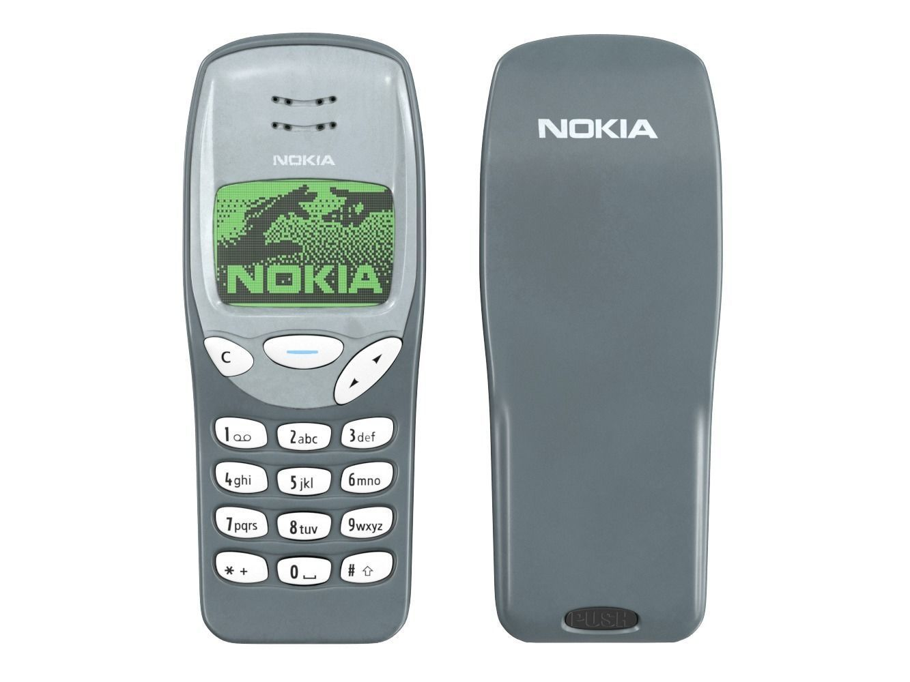

# T9 converter text

A simple script to convert text to numbers as if typing on an old Nokia cell phone.

# Explicação

Old cell phones used keypads with the T9 standard (Text on 9 keys), where each key represents a set of characters. For example, the characters `a`, `b`, and `c` are mapped to key 2, the characters `d`, `e`, and `f` to key 3, and so on until the end of the alphabet.

To write the word `faca` (knife), it is necessary to press key 3 three times, key 2 once, key 2 three times, and finally key 2 once. Tedious, right? This ends up generating some numeric sequences like the following examples.

| Word    | Number          |
|---------|-----------------|
| tijolao | 844456665558666 |
| carro   | 2222777777666   |
| faca    | 33322222        |
